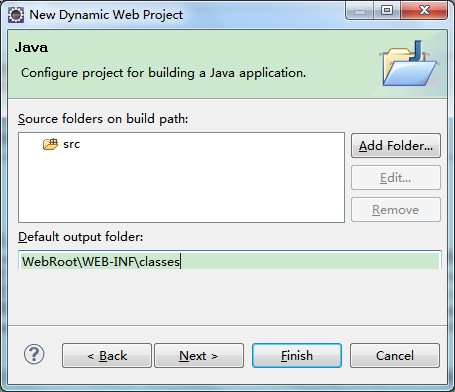

# 1.1 创建项目

JFinal 推荐使用Eclipse IDE for Java EE Developers做为开发环境。

[下载链接](http://www.eclipse.org/downloads/download.php?file=/technology/epp/downloads/release/luna/SR2/eclipse-jee-lun a-SR2-win32-x86_64.zip)

[IDEA 用户快速上手](IDEA 用户快速上手参见这里:http://my.oschina.net/chixn/blog/471755)

   
##创建Dynamic Web Project

  
    
  
##填入项目基本信息

  
    
**注意：** Target runtime 一定要选择<None>
   
##修改Default Output Folder，推荐输入WebRoot\WEB-INF\classes

  

特别注意：此处的 Default out folder必须要与 WebRoot\WEB-INF\classes 目录完全一致才可以使用 JFinal 集成的 Jetty 来启动项目。
    
##修改Content directory，推荐输入WebRoot

  
    
**注意：** 此处也可以使用默认值WebContent， 但上一步中的WebRoot\WEB-INF\classes则需要改成WebContent\WEB-INF\classes才能对应上。
   
    

